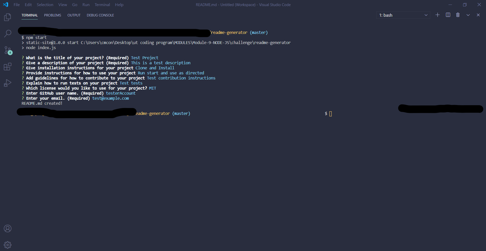

# Note Taker

<!---
add screenshot to directory if desired

-->

## Description

A browser-based note taking application with data persistence

## Table of Contents
  * [Installation](#installation)
  * [Usage](#usage)
  * [License](#license)
  * [Contributing](#contributing)
  * [Testing](#testing)
  * [Questions](#questions)
  
## Installation
Clone project into a local directory and cd into note-taker directory.  Run npm install, then once all packages have been installed, run npm start, and verify server start message in console.  Navigate to port 3001 of your localhost.  Add note title and body, then press disk icon to save note.  Click on any note title in the left sidebar to display the note's contents in the main display area. 

## Usage
Add note title and body, then press disk icon to save note.  Click on any note title in the left sidebar to display the note's contents in the main display area. Click trash can icon to delete the currently loaded  note.

## License 
This project is covered under the MIT license 

## Contributing

## Testing
None

## Questions
Visit me at GitHub  
[christopherConcannon](https://github.com/christopherConcannon)
  
If you have any questions or would like to contact me, please email me at  
[cmcon@yahoo.com](mailto:cmcon@yahoo.com)
